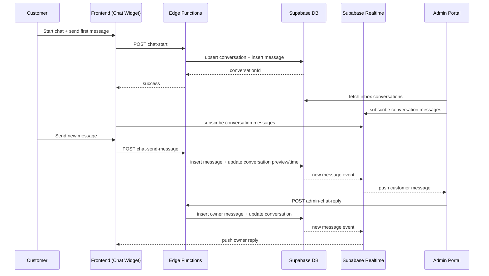

# Customer ↔ Owner Chat Workflow

This document defines a complete workflow where customers can chat with the store owner, and the owner can reply from the admin portal.

---

## 1) Goals

- Allow customers to start and continue support/order-related chat.
- Allow owner/admin to manage and reply from admin portal.
- Support authenticated users and guests.
- Provide real-time updates, unread counts, and resolve/close flow.

---

## 2) User Experience

## Customer

- Customer opens chat widget (global) or “Chat about this order” from order details page.
- Customer sends message(s), receives owner replies in real time.
- Customer sees delivery states:
  - sending
  - sent
  - failed (retry)
- Optional image attachment support.

## Owner/Admin

- Owner opens admin inbox.
- Sees list of conversations with:
  - customer identity
  - order reference (if linked)
  - unread count
  - last message + timestamp
- Opens thread and replies.
- Can mark conversation as resolved/closed.

---

## 3) Data Model (Supabase)

## Table: `conversations`

| Column | Type | Notes |
|---|---|---|
| id | uuid pk | default `gen_random_uuid()` |
| customer_user_id | text nullable | Clerk/Supabase user id if logged in |
| guest_token | text nullable | for guest continuity |
| order_id | uuid nullable | fk to `orders.id` |
| subject | text nullable | optional topic |
| status | text | `open`, `resolved`, `closed` |
| last_message_at | timestamptz | for inbox ordering |
| last_message_preview | text | latest preview |
| created_at | timestamptz | default `now()` |
| updated_at | timestamptz | default `now()` |

## Table: `conversation_messages`

| Column | Type | Notes |
|---|---|---|
| id | uuid pk | default `gen_random_uuid()` |
| conversation_id | uuid | fk `conversations.id` |
| sender_type | text | `customer` or `owner` |
| sender_id | text nullable | actor id |
| message | text | required text |
| attachment_url | text nullable | storage path/url |
| is_read | boolean | default `false` |
| created_at | timestamptz | default `now()` |

## Optional table: `conversation_participants`

Useful for future multi-agent support:
- `conversation_id`
- `user_id`
- `role` (`customer`, `owner`, `staff`)

---

## 4) Suggested SQL Migration

```sql
-- conversations
create table if not exists public.conversations (
  id uuid primary key default gen_random_uuid(),
  customer_user_id text null,
  guest_token text null,
  order_id uuid null references public.orders(id) on delete set null,
  subject text null,
  status text not null default 'open' check (status in ('open','resolved','closed')),
  last_message_at timestamptz not null default now(),
  last_message_preview text null,
  created_at timestamptz not null default now(),
  updated_at timestamptz not null default now()
);

create index if not exists idx_conversations_status_last_message
  on public.conversations(status, last_message_at desc);

create index if not exists idx_conversations_customer_user
  on public.conversations(customer_user_id);

create index if not exists idx_conversations_guest_token
  on public.conversations(guest_token);

create index if not exists idx_conversations_order
  on public.conversations(order_id);

-- messages
create table if not exists public.conversation_messages (
  id uuid primary key default gen_random_uuid(),
  conversation_id uuid not null references public.conversations(id) on delete cascade,
  sender_type text not null check (sender_type in ('customer','owner')),
  sender_id text null,
  message text not null,
  attachment_url text null,
  is_read boolean not null default false,
  created_at timestamptz not null default now()
);

create index if not exists idx_messages_conversation_created
  on public.conversation_messages(conversation_id, created_at asc);

create index if not exists idx_messages_unread
  on public.conversation_messages(conversation_id, is_read);

-- updated_at trigger (if you already have a shared trigger function, reuse it)
create or replace function public.set_updated_at()
returns trigger
language plpgsql
as $$
begin
  new.updated_at = now();
  return new;
end;
$$;

drop trigger if exists trg_conversations_updated_at on public.conversations;
create trigger trg_conversations_updated_at
before update on public.conversations
for each row execute function public.set_updated_at();
```

---

## 5) RLS / Access Strategy

Use a hybrid model:
- **Client reads** with RLS (realtime + thread fetch)
- **Writes through Edge Functions** (secure actor validation for customer/admin)

## RLS principles

- Customer can read own conversation/messages if:
  - `customer_user_id = auth.uid()::text`
  - OR validated guest session token path (recommended via edge function mediated access)
- Admin can read/write all conversation data via service-role edge functions.
- Prevent direct client-side owner message inserts unless admin claims are verifiable in JWT.

---

## 6) Edge Functions (API Contract)

All are expected at `/functions/v1/<function-name>`.

## `POST /functions/v1/chat-start`

Create (or reuse) conversation and send first customer message.

Request:
```json
{
  "orderId": "<optional-uuid>",
  "subject": "Delivery issue",
  "initialMessage": "Hi, where is my order?",
  "guestToken": "<optional>"
}
```

Response:
```json
{
  "conversationId": "<uuid>",
  "status": "open"
}
```

## `POST /functions/v1/chat-send-message`

Send customer message.

Request:
```json
{
  "conversationId": "<uuid>",
  "message": "Any update?",
  "attachmentUrl": null,
  "guestToken": "<optional>"
}
```

## `POST /functions/v1/admin-chat-reply`

Owner/admin reply from admin portal.

Request:
```json
{
  "conversationId": "<uuid>",
  "message": "Your order ships tomorrow.",
  "attachmentUrl": null
}
```

## `POST /functions/v1/admin-chat-mark-read`

Mark customer messages as read by owner/admin.

## `POST /functions/v1/chat-close`

Set conversation status:
- `resolved`
- `closed`

---

## 7) Realtime Flow

Subscribe to `conversation_messages` changes filtered by `conversation_id`.

- Customer thread view receives owner messages instantly.
- Admin thread view receives customer messages instantly.
- Admin inbox can also subscribe to `conversations` updates for unread badge refresh.

---

## 8) Sequence Diagram



---

## 9) Failure / Retry Paths

- Message insert failure:
  - show failed state in UI
  - allow retry (resend same payload)
- Realtime disconnect:
  - fallback to polling thread every 10–20s
- Attachment upload failure:
  - allow text-only send
- Guest token missing/expired:
  - regenerate token and re-link open conversation via `chat-start`
- Admin reply failure:
  - optimistic UI rollback + retry CTA

---

## 10) Integration points in this repository

## Customer side

- Add chat entry points in:
  - `src/pages/OrderDetails.tsx` (“Chat with owner about this order”)
  - optional global widget near layout shell/header

## Admin side

- Add admin views/components:
  - `src/components/admin/AdminChatInbox.tsx`
  - `src/components/admin/AdminChatThread.tsx`
- Add route in admin portal navigation (e.g., `/admin/chats`)

## Supabase

- New functions under:
  - `supabase/functions/chat-start`
  - `supabase/functions/chat-send-message`
  - `supabase/functions/admin-chat-reply`
  - `supabase/functions/admin-chat-mark-read`
  - `supabase/functions/chat-close`

---

## 11) Implementation checklist

- [ ] Create SQL migration for chat tables/indexes/triggers.
- [ ] Add RLS policies.
- [ ] Implement edge functions (customer + admin).
- [ ] Add customer chat widget/thread UI.
- [ ] Add admin inbox/thread UI.
- [ ] Add realtime subscriptions.
- [ ] Add unread counters + mark-read actions.
- [ ] Add notification hooks (email/push) as optional enhancement.

---

## 12) Suggested Phase Rollout

1. **Phase 1 (MVP):** text-only chat, authenticated customers, admin replies.
2. **Phase 2:** guest token support + unread counters + resolve/close.
3. **Phase 3:** attachments, templates, SLA labels, analytics.

