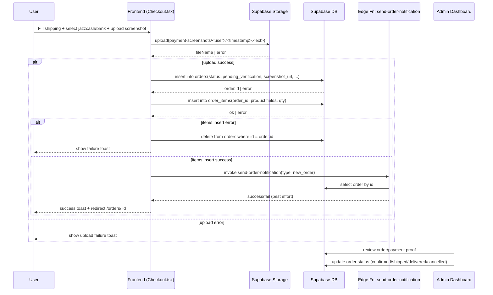
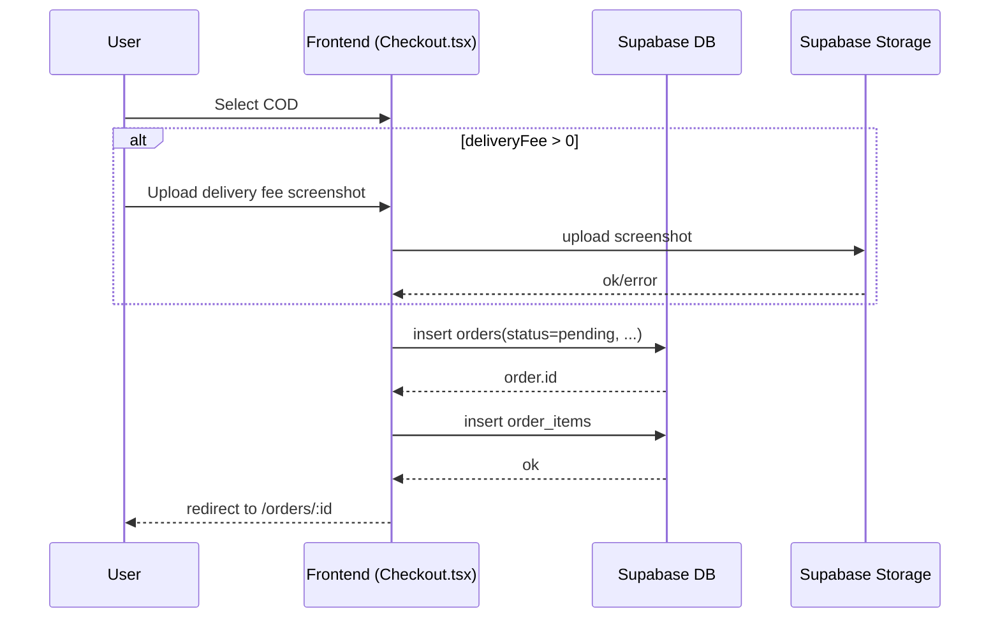
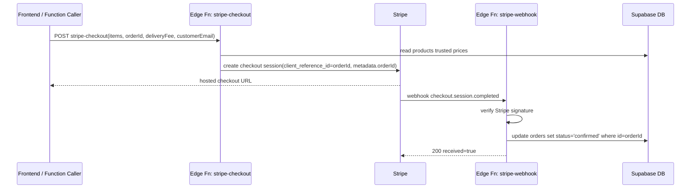

# Order Workflow (Add to Cart → Checkout → Order Completion)

> Repository: `saadkhantareen/fresh-cart`  
> Snapshot analyzed from commit: `6edc91ed3cf37426d87816b2252584f148b7fc37`

This document maps the full order lifecycle currently implemented in the codebase, including frontend flow, Supabase calls, edge functions, webhooks, and failure/retry paths.

---

## 1) End-to-end lifecycle overview

1. **Add to Cart**
   - User adds products to client-side cart store (`useCartStore`).
   - Cart state is used by `/cart` and `/checkout`.

2. **Cart Review (`/cart`)**
   - Subtotal and delivery fee are computed in frontend.
   - User proceeds to `/checkout`.

3. **Checkout (`/checkout`)**
   - Shipping data entered.
   - Payment method selected:
     - `jazzcash`
     - `bank`
     - `cod` (with optional delivery-fee screenshot requirement)
   - Screenshot uploaded to Supabase Storage bucket `payment-screenshots` when required.

4. **Order Creation**
   - `orders` row inserted.
   - `order_items` rows inserted.
   - Notification function called for new order.
   - User redirected to `/orders/:orderId`.

5. **Post-order visibility**
   - Customer views own orders (`/orders`) and details (`/orders/:id`).
   - Admin views all orders via `admin-data` function and updates status.

6. **Order completion path**
   - Admin updates statuses (`confirmed` → `shipped` → `delivered`) or `cancelled`.
   - Notification function is invoked for important status changes.

---

## 2) Key files and functions

## Frontend pages/components

- `src/pages/Cart.tsx`
  - Uses `useCartStore()` for cart items, quantity updates, totals.
  - Computes delivery fee and final total client-side.

- `src/pages/Checkout.tsx`
  - Core functions:
    - `validateShippingAddress(address)`
    - `buildOrderItems(orderId, sourceItems)`
    - `createOrderWithItems(status, address, total, paymentScreenshotUrl?, sourceItems?)`
    - `handlePlaceOrder()`
  - Storage upload call via:
    - `supabase.storage.from('payment-screenshots').upload(fileName, paymentScreenshot)`

- `src/pages/Orders.tsx`
  - Fetches user orders through edge function call:
    - `supabase.functions.invoke('admin-data', { body: { table: 'user_orders', userId, userName } })`

- `src/pages/OrderDetails.tsx`
  - Reads order and items directly:
    - `supabase.from('orders').select('*').eq('id', orderId).single()`
    - `supabase.from('order_items').select('*').eq('order_id', orderId)`

- `src/components/admin/AdminOrders.tsx`
  - Reads all orders via `admin-data` function.
  - Reads `order_items` directly.
  - Status update through `admin-data` with `action: 'update_order'`.
  - Sends status emails through `send-order-notification`.

## Supabase Edge Functions

- `supabase/functions/admin-data/index.ts`
  - CORS includes `POST, GET, OPTIONS`.
  - Uses service-role Supabase client (`createClient(SUPABASE_URL, SUPABASE_SERVICE_ROLE_KEY)`).
  - Supports admin/user data access and admin order updates.

- `supabase/functions/send-order-notification/index.ts`
  - Reads order by `orderId` and sends email based on `type`.

- `supabase/functions/stripe-checkout/index.ts`
  - Creates Stripe Checkout Session.
  - Fetches trusted product prices from DB before line-item creation.

- `supabase/functions/stripe-webhook/index.ts`
  - Verifies Stripe signature and handles `checkout.session.completed`.
  - Updates order status to `confirmed` using service-role client.

- `supabase/functions/clerk-webhook/index.ts`
  - Syncs `user.created` payload into `users` table.

---

## 3) Endpoints (GET/POST/webhooks)

These are invoked via Supabase Functions runtime URLs:
`/functions/v1/<function-name>`

- `POST /functions/v1/admin-data`
  - Used by:
    - Customer order list fetch (`table: 'user_orders'`)
    - Admin all-orders fetch (`table: 'orders'`)
    - Admin order update (`action: 'update_order'`)

- `POST /functions/v1/send-order-notification`
  - Used by:
    - Checkout (new order event)
    - Admin status transitions (`shipped`, `delivered`, `cancelled`; also approval flows)

- `POST /functions/v1/stripe-checkout`
  - Creates hosted Stripe checkout session URL.

- `POST /functions/v1/stripe-webhook` (webhook receiver)
  - Stripe sends events here.
  - Handles `checkout.session.completed`.

- `POST /functions/v1/clerk-webhook` (webhook receiver)
  - Clerk sends events here.
  - Handles `user.created`.

- `GET /functions/v1/admin-data` (allowed by CORS methods)
  - CORS allows GET, but client code paths shown are POST-style `invoke` calls.

---

## 4) Detailed checkout and order creation flow

From `src/pages/Checkout.tsx`:

1. `handlePlaceOrder()` validates shipping fields.
2. Branch by `paymentMethod`:
   - `jazzcash`: screenshot required.
   - `bank`: screenshot required.
   - `cod`: screenshot required only when `deliveryFee > 0`.
3. If screenshot provided/required:
   - Upload image to storage bucket `payment-screenshots`.
4. Create DB order via `createOrderWithItems(...)`:
   - Build `createPayload` with shipping/customer/total/status/user_id/payment_screenshot_url.
   - Insert into `orders`.
   - On insert error, fallback insert path forces guest insert (`user_id: null`) and stores Clerk marker in `notes`.
   - Build and insert `order_items` rows.
   - If `order_items` insert fails, delete created `orders` row (orphan cleanup).
5. Best-effort async side effect:
   - Invoke `send-order-notification` with `{ orderId, type: 'new_order' }`.
6. Success UX:
   - Clear cart.
   - Navigate to `/orders/<id>`.

Status selection at creation:
- `pending_verification` for JazzCash/Bank (and proofs).
- `pending` for COD.

---

## 5) Supabase client calls (exact usage map)

## Checkout page (`src/pages/Checkout.tsx`)

- Auth:
  - `supabase.auth.getUser()`
  - `supabase.auth.signOut()` (on definitive auth failure)

- Storage:
  - `supabase.storage.from('payment-screenshots').upload(fileName, paymentScreenshot)`

- Tables:
  - `supabase.from('orders').insert(...).select('id').single()`
  - `supabase.from('order_items').insert(orderItems)`
  - `supabase.from('orders').delete().eq('id', order.id)` (cleanup on child insert failure)

- Edge functions:
  - `supabase.functions.invoke('send-order-notification', { body: { orderId, type: 'new_order' } })`

## Orders list (`src/pages/Orders.tsx`)

- Edge functions:
  - `supabase.functions.invoke('admin-data', { body: { table: 'user_orders', userId, userName } })`

## Order details (`src/pages/OrderDetails.tsx`)

- Tables:
  - `supabase.from('orders').select('*').eq('id', orderId).single()`
  - `supabase.from('order_items').select('*').eq('order_id', orderId)`

## Admin orders (`src/components/admin/AdminOrders.tsx`)

- Edge functions:
  - `supabase.functions.invoke('admin-data', { body: { table: 'orders' } })`
  - `supabase.functions.invoke('admin-data', { body: { action: 'update_order', orderId, updateData } })`
  - `supabase.functions.invoke('send-order-notification', { body: { orderId, type } })`

- Tables:
  - `supabase.from('order_items').select('*').eq('order_id', orderId)`

- Storage:
  - `supabase.storage.from('payment-screenshots').getPublicUrl(order.payment_screenshot_url)`

## Stripe checkout function (`supabase/functions/stripe-checkout/index.ts`)

- Service-role table reads:
  - `supabase.from('products').select('id, name, price').in('id', productIds)`

## Stripe webhook function (`supabase/functions/stripe-webhook/index.ts`)

- Service-role table writes:
  - `supabase.from('orders').update({ status: 'confirmed' }).eq('id', orderId)`

## Send-order-notification function (`supabase/functions/send-order-notification/index.ts`)

- Service-role table reads:
  - `supabase.from('orders').select('*').eq('id', orderId).single()`

## Clerk webhook function (`supabase/functions/clerk-webhook/index.ts`)

- Service-role table writes:
  - `supabase.from('users').insert({ id, email, full_name, created_at })`

---

## 6) SQL/RPC usage

## SQL-style table operations used

- `select`, `insert`, `update`, `delete`, `eq`, `in`, `single`
- Implemented through Supabase JS query builder on:
  - `orders`
  - `order_items`
  - `products`
  - `users`

## RPC usage

- No explicit `supabase.rpc(...)` usage was found in the traced order lifecycle paths above.

---

## 7) Tables and storage touched (read/write matrix)

| Resource | Read | Write | Where |
|---|---:|---:|---|
| `orders` | ✅ | ✅ | checkout create/delete fallback cleanup; order details read; notifications read; stripe webhook update; admin-data flows |
| `order_items` | ✅ | ✅ | checkout insert; order details/admin detail reads |
| `products` | ✅ | ❌ | stripe-checkout trusted pricing lookup |
| `users` | ❌ (in traced order flow) | ✅ | clerk-webhook user sync |
| Storage bucket `payment-screenshots` | ✅ (public URL generation) | ✅ (upload) | checkout upload; admin preview |

> Note: `admin-data` also mediates order reads/updates; internal branching may touch additional objects depending on request payload and future changes.

---

## 8) Sequence diagrams

## A) Manual payment path (JazzCash/Bank) + order creation

## B) COD path

## C) Stripe asynchronous confirmation path

---

## 9) Failure and retry paths

## Checkout-level failures

- **Missing auth on checkout entry**
  - Redirect to `/auth?returnTo=/checkout`.

- **Invalid shipping address**
  - UI validation fails; user stays in step 1.

- **Missing required screenshot**
  - UI toast error; no DB writes attempted.

- **Storage upload failure**
  - Toast error; no order creation attempted.

- **`orders` insert failure**
  - Fallback logic tries guest order (`user_id: null`) path.
  - Includes Clerk marker in `notes` when available.

- **`order_items` insert failure after order created**
  - Compensating delete of `orders` row attempted.
  - Prevents orphan order records where possible.

- **Notification function failure**
  - Logged but non-blocking (order remains created).

## Webhook failures

- **Stripe webhook signature missing/invalid**
  - Returns `400`; Stripe will retry based on Stripe retry policy.

- **Stripe DB update error**
  - Returns `500`; webhook delivery can be retried by Stripe.

- **Missing `orderId` in Stripe event**
  - Logged as error; no status update applied.

## Admin-side failures

- `admin-data` fetch/update failures show toast and preserve UI state.
- Notification send on status changes is best-effort and logged on failure.

---

## 10) Status model observed

Order statuses present in UI/components:

- `pending_verification`
- `pending`
- `confirmed`
- `shipped`
- `delivered`
- `cancelled`

Typical progression:

- Manual prepayment: `pending_verification` → `confirmed` → `shipped` → `delivered`
- COD: `pending` → `confirmed` → `shipped` → `delivered`
- Any stage may become `cancelled` via admin action.

---

## 11) Known implementation notes relevant to lifecycle

- `createOrderWithItems` currently has `if (isRlsError || true)` which **always** forces guest fallback path when first insert fails.
- This means user linkage may be moved to notes (`[clerk:<id>]`) in fallback scenarios.
- Stripe function files exist and are functional, even if checkout UI currently prioritizes JazzCash/Bank/COD.

---

## 12) Quick reference: lifecycle touchpoints by file

- Cart/checkout UX and order write path:
  - `src/pages/Cart.tsx`
  - `src/pages/Checkout.tsx`

- Customer order read paths:
  - `src/pages/Orders.tsx`
  - `src/pages/OrderDetails.tsx`

- Admin operational path:
  - `src/components/admin/AdminOrders.tsx`
  - `supabase/functions/admin-data/index.ts`

- Async side effects and webhooks:
  - `supabase/functions/send-order-notification/index.ts`
  - `supabase/functions/stripe-checkout/index.ts`
  - `supabase/functions/stripe-webhook/index.ts`
  - `supabase/functions/clerk-webhook/index.ts`
